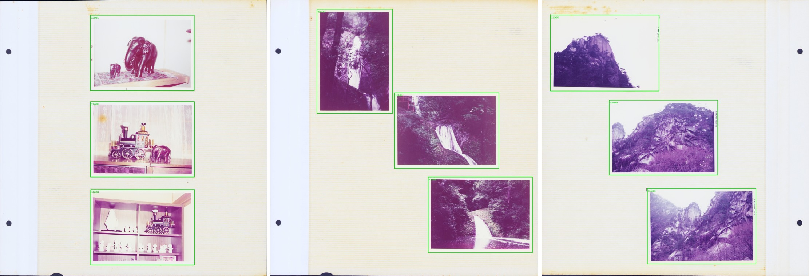
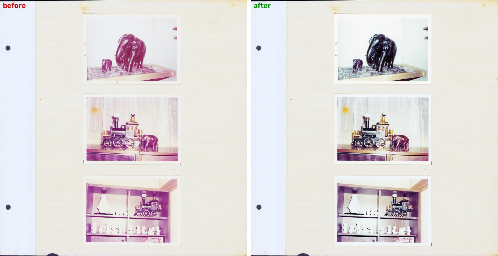
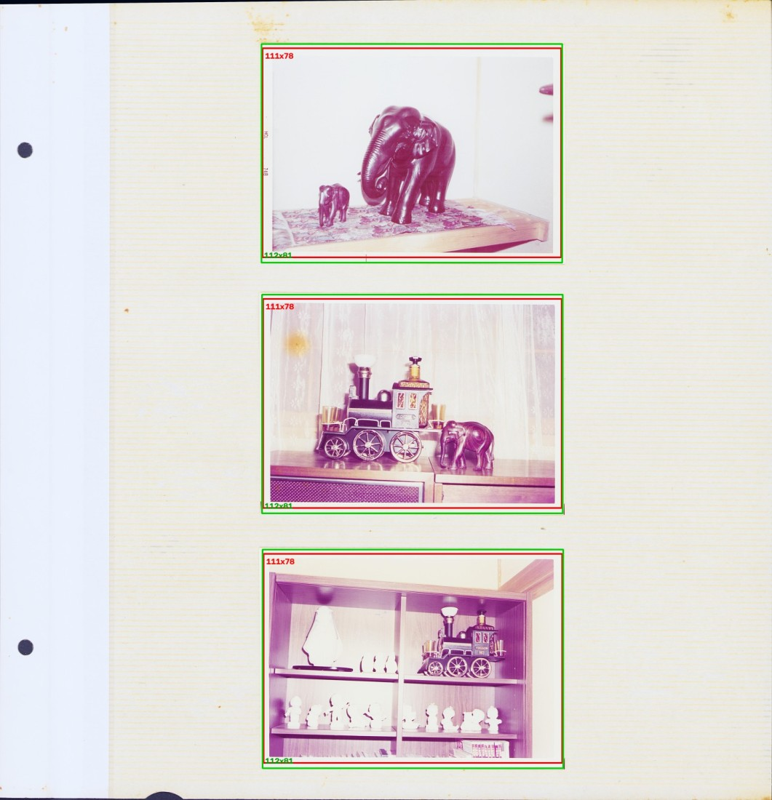

# album-scan-restore

台紙に貼られた古い写真アルバムをスキャンした画像から、**プリントを 1 枚ずつ切り出して、褪せた色を戻す**ツールです。

> Detects individual photo prints on scanned album pages and restores their faded colours.
> The key idea: **the print sizes are estimated from the album itself**, not matched against a
> table of standard paper sizes. See [なぜ定型サイズ表を使わないか](#なぜ定型サイズ表を使わないか).

実際の家族アルバム **36 冊 / 1,035 ページ / 約 3,600 枚**のスキャンで開発・検証しました。



---

## 何をするか

```
アルバムのページ画像            プリント 1 枚ずつ            色を戻したページ
┌──────────────┐         ┌────┐┌────┐         ┌──────────────┐
│  ┌────┐┌────┐│   →     │    ││    │    →    │  ┌────┐┌────┐│
│  └────┘└────┘│         └────┘└────┘         │  └────┘└────┘│
│  ┌────┐      │  枠の検出  ┌────┐              │  ┌────┐      │
│  └────┘      │         └────┘               │  └────┘      │
└──────────────┘                              └──────────────┘
```

1. **枠の検出** — ページのどこにプリントが貼られているかを、小さな U-Net（110 万
   パラメータ / 4.4MB）で求めます。
2. **判型の推定** — その **アルバム自身の検出結果**から、使われている紙の寸法を
   推定します。同じアルバムのプリントは同じ紙なので、寸法は数種類に集まります。
3. **枠の確定** — 推定した判型に寸法を合わせます。近い判型が無ければ、検出した
   寸法をそのまま使います。
4. **色の復元** — プリント 1 枚ずつ独立に、伸張・色かぶりの中和・彩度・
   ハイライトの脱色を行います。ページ全体をまとめて補正すると、いちばん褪せた
   1 枚に引きずられて他が転びます。



---

## なぜ定型サイズ表を使わないか

素直に考えると、E判 82.5x117mm・L判 89x127mm といった**定型プリントの一覧**を
持っておき、検出した枠をいちばん近い定型に合わせるのが良さそうに見えます。
実際、最初はそう作りました。当てはまるアルバムでは強力に働きます。

**外れるアルバムでは、枠が数 mm から数 cm ずれます。** 実データで確認できた
外れ方は 3 種類ありました。

| 外れ方 | 例 |
|---|---|
| 定型に無い紙 | 中判（6x6）の正方形プリント、ラボの縁印字が入る紙、トリミングされたスナップ |
| 判型が 1 枚ごとに違う | 記念写真ばかりの冊。実測 158x116 / 204x152 / 211x161 と全部違い、共通の判型が無い |
| 近い定型が 2 つある | 80x108 と 82.5x117 が混在する冊で、検出寸法が中間に来ると選択を誤る |

下のページでは、判型を定型に写した枠（赤 111x78mm）が写真の下端を 3mm 切り落として
いるのに対し、アルバム自身から推定した判型の枠（緑 112x81mm）が紙にぴったり
乗っています。**同じずれがこのアルバムの全ページで起きます**（判型は冊単位で
決まるため）。人が 1 枚ずつ直すことになるのはこの種の系統的なずれです。



一方で、**同じアルバムの中では紙が揃っています**（同じ時期に同じラボで焼いた
ものだから）。検出寸法をアルバム単位で集めると、判型の数だけ密集した山ができます。
その山を数えて代表値を取れば、外部の表を持ち込まずに判型が決まります。

```
そのアルバムの検出寸法（短辺 x 長辺 mm）を平均シフトでクラスタリング

  長辺 ↑
   120 |            ●●●          ← 81.0 x 117.5 が 84 枚（このアルバムの主判型）
       |           ●●●●●
   110 |
       |
    90 |     ●●                  ← 87.2 x 88.3 が 24 枚（中判の正方形）
       |     ●
       +---------------------→ 短辺
            80    85    90
```

判型が推定できないアルバム（1 枚ごとに紙が違う）では、**寸法合わせをせずに
検出した値をそのまま使います**。これが「表に当てはめる」方式との決定的な違いです。

---

## 白フチのあるプリント / ないプリント

プリントには白フチのあるものと、フチなし（紙いっぱいに画像がある）ものがあります。
両方が同じアルバムに混ざることもあります。

このツールは**どちらも同じ扱いで済みます**。検出しているのは「プリントの紙の
外形」であって画像領域ではないため、白フチの有無で処理を切り替える必要が
ありません。実データで確かめた結果、白フチと台紙の色の差は Lab で ΔE 1〜3 しか
なく、**色で白フチを見つける方式は原理的に成立しません**でした（退色して黄ばんだ
白フチ、台紙自体が白いアルバム、のどちらでも破綻します）。輪郭を学習した
モデルはこの差を捉えています。

---

## 精度をどう測るか

**人が引いた枠を「正解」として最適化してはいけない**、というのがこのプロジェクトで
いちばん高くついた教訓です。

手作業で 1,035 ページ分の枠を確定させ、それを正解として測ると「そのまま使える枠」は
87% でした。ところがその枠の一部は、作業のときに定型サイズのドロップダウンから
選んだせいで、**紙の外形から 5〜6mm 外れていました**。この正解に合わせて最適化すると、
アルゴリズムは「定型に引きずられた枠を再現する」方向に進みます。

そこで、**正解データを使わない指標**を用意しました（`albumscan/quality.py`）。

| 指標 | 意味 |
|---|---|
| `fit` | 枠の内側の帯と外側の帯の「プリント内側らしさ」の差。1 に近いほど枠が紙の縁に乗っている |
| `uncovered` | どの枠にも入らなかったプリント画素の割合（＝検出漏れ） |
| `overlap` | 枠どうしの重なり（正しい枠は重ならない） |

同じ 36 冊 1,035 ページで比較した結果:

| | 定型サイズ表に吸着（従来） | アルバム自身から判型を推定（本ツール） |
|---|---:|---:|
| `fit` 平均 | 0.315 | **0.467** |
| `fit` 下位 5% | 0.168 | **0.357** |
| 検出漏れ | 4.4% | **2.8%** |
| 枠の重なり | 0.1% | 0.1% |

`fit` の下位 5% が倍以上になっている点が実用上いちばん効きます。**平均が良くても
外れ枠が残っていると、人が全ページを見て直すことになる**からです。

---

## 使い方

```bash
pip install -r requirements.txt

# 1 冊のフォルダを処理する（アルバムごとにフォルダを分けておく）
python -m albumscan detect "path/to/アルバム" --model models/boundary.pt

# 直下のフォルダをそれぞれ 1 冊として処理する
python -m albumscan detect "path/to/scans" --recursive --model models/boundary.pt

# 枠を確認する画像を書き出す
python -m albumscan overlay "path/to/アルバム" --boxes "path/to/アルバム/boxes.json" --out 枠確認

# 原寸から 1 枚ずつ切り出す
python -m albumscan crop "path/to/アルバム" --boxes "path/to/アルバム/boxes.json" --out 切り出し

# 枠の中の色を戻したページを書き出す
python -m albumscan restore "path/to/アルバム" --boxes "path/to/アルバム/boxes.json" --out 補正後
```

同梱のサンプルでそのまま試せます。

```bash
python -m albumscan detect  examples/album --model models/boundary.pt --out boxes.json
python -m albumscan overlay examples/album --boxes boxes.json --out out/overlay
python -m albumscan restore examples/album --boxes boxes.json --out out/restored
```

```
album  3 頁  標本 7  判型: 81.3x111.9×5
  枠 9 個 → boxes.json   輪郭との一致 平均0.485 最小0.451
```

`detect` はページをまとめて見てから判型を決めるので、**1 冊単位で走らせてください**。
1 ページだけを渡すと、そのページに写真が 2 枚しか無いときに判型が決まりません。

主なオプション:

| オプション | 既定 | 説明 |
|---|---|---|
| `--dpi` | 600 | スキャン解像度。mm 換算に使う |
| `--long-side` | 1500 | 検出に使う縮小画像の長辺 |
| `--snap-max-mm` | 4.0 | 判型に寸法を合わせる上限。`0` で「合わせない」 |
| `--cache` | `<folder>/_cache` | 輪郭マップの置き場 |

### テスト

合成した輪郭マップで、枠を作る 4 段の振る舞いを確かめます（実データは要りません）。

```bash
python -m unittest discover -s tests
```

### ライブラリとして使う

```python
from albumscan.album import Album
from albumscan.segment import Segmenter

alb = Album('path/to/アルバム')
alb.prepare(Segmenter('models/boundary.pt'))
catalogue, n = alb.fit_sizes()     # [(短辺mm, 長辺mm, 標本数), ...]
result = alb.detect()              # {ページ: {'boxes': [...], 'quality': {...}}}
```

---

## 既知の制約

* **台紙が白く、写真を 1 枚だけ貼ったページ**では、輪郭マップが台紙まで写真と
  判定することがあります。閾値を上げて取り直す救済を入れてありますが、
  完全ではありません（実データの 1 冊 21 ページで検出漏れが 27% 残りました）。
* **傾いて貼られたプリント**は、外接矩形で扱うため台紙が少し入ります。
  回転の推定は入れていません。
* **同梱モデルは日本の家庭用アルバム**（クリーム色の台紙、1970〜80 年代の
  カラープリント）で学習しています。台紙の質感が大きく違うアルバムでは
  作り直しが要ります。
* 色の復元は「画面の大半を実在する強い色が占める写真」（芝生、赤い花の
  クローズアップ）で、その色を色かぶりと誤認することがあります。
  `ai` / `bi` を外から与えて上書きできます。

---

## ライセンス

MIT License. 同梱のサンプル画像は、人物が写っておらず撮影場所が特定できない
ページだけを選んでいます。
